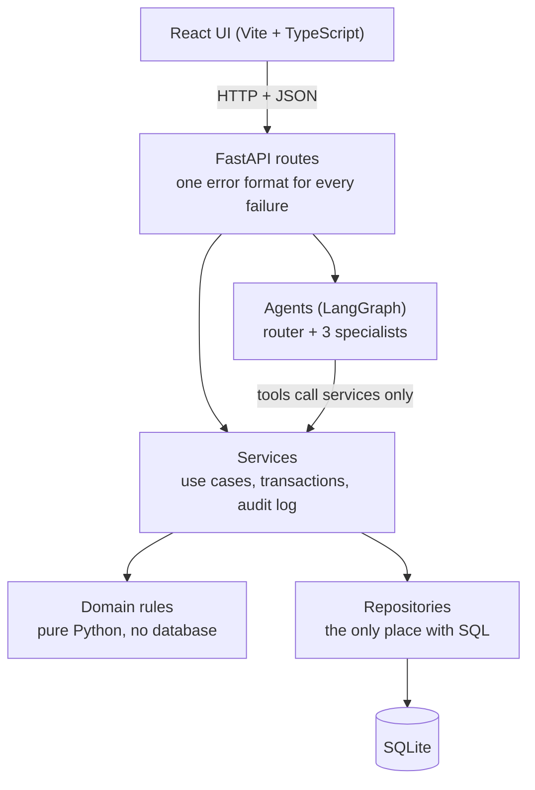
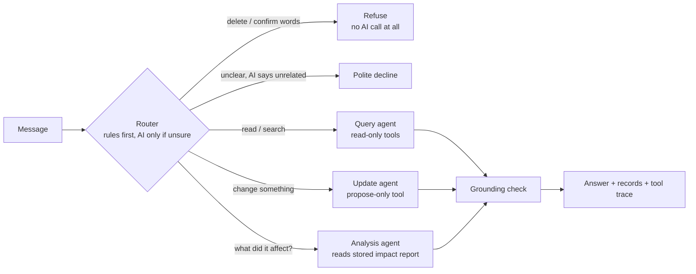
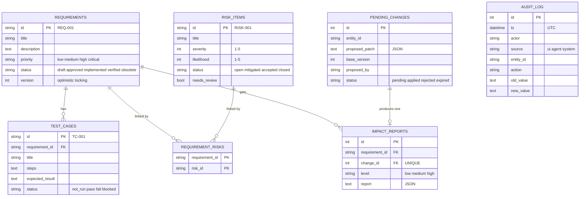

# Engineering Knowledge Agent

[](https://github.com/RachnA94664/engineering-knowledge-agent/actions/workflows/ci.yml)

A small AI-assisted system that stores **Requirements**, **Test Cases** and **Risk Items** in a
database and lets you work with them in plain English.

> Ask *"Which requirements have no test cases?"* and get an answer taken **from the database**,
> with the records it is based on. Say *"Set REQ-006 priority to high"* and the AI **proposes**
> the change; a **person confirms** it, and the system then works out automatically what the
> change affects (which tests must be re-run, which risks need a second look).

**The three ideas this project is built around**

1. **The AI never invents data.** Every answer must come from tool results, and every ID in an
   answer is checked against them.
2. **The AI never changes data.** It can only *propose*. A human presses *Confirm*.
3. **Everything is recorded.** Every change goes into an append-only audit log.

**At a glance:** Python 3.12, FastAPI, SQLite + SQLAlchemy + Alembic, LangGraph + LangChain,
React + TypeScript (Vite), Docker, GitHub Actions. The AI can be **Groq** (fast, free tier),
**Ollama** (free, runs on your PC) or **OpenAI** (paid), chosen by one setting.

---

## Contents

1. [What the application does](#1-what-the-application-does)
2. [Assignment checklist: where each requirement lives](#2-assignment-checklist-where-each-requirement-lives)
3. [Quick start](#3-quick-start)
4. [Architecture](#4-architecture)
5. [Database design](#5-database-design)
6. [Agent design](#6-agent-design)
7. [Rules and validations](#7-rules-and-validations)
8. [The automatic impact workflow](#8-the-automatic-impact-workflow)
9. [Example user queries](#9-example-user-queries)
10. [API overview](#10-api-overview)
11. [Tests and CI](#11-tests-and-ci)
12. [Deploying](#12-deploying)
13. [Project structure and how to change things](#13-project-structure-and-how-to-change-things)
14. [Technical decisions and why](#14-technical-decisions-and-why)
15. [How it was built](#15-how-it-was-built)
16. [Known limitations](#16-known-limitations)
17. [Troubleshooting](#17-troubleshooting)
18. [Git workflow](#18-git-workflow)

---

## 1. What the application does

| You want to... | Where | What happens |
|---|---|---|
| Ask a question about the data | **Ask** page | A router picks a specialist agent; it reads the database with tools; the answer shows a verdict badge and the records behind it |
| Ask for a change | **Ask** page | The agent creates a *proposal*; nothing changes yet |
| Review and decide on proposals | **Pending** page | You see current vs. proposed values and press *Confirm* or *Reject* |
| See what a change affected | after *Confirm*, or **Requirements** → a requirement | The impact report: tests reset, risks flagged, warnings, impact level |
| Browse and filter | **Requirements**, **Risks** | Summary cards and filterable tables; risks flagged for review can be marked *reviewed* |
| Check who did what | **Audit log** | Every change: who, when, before, after, and whether a person, the agent or the system did it |

The sample data is an EV-charging-station product: 15 requirements, 30 test cases, 12 risk items
and 16 requirement-to-risk links.

---

## 2. Assignment checklist: where each requirement lives

| Requirement | Done | Where to look |
|---|---|---|
| Database with Requirements, Test Cases, Risk Items and relationships | ✅ | `backend/app/db/models.py`, `backend/migrations/` ([section 5](#5-database-design)) |
| Dummy data, **validated before insert** | ✅ | `backend/data/seed_raw.json`, `backend/app/db/seed.py` |
| Multi-agent system that answers from the database | ✅ | `backend/app/agents/graph.py` ([section 6](#6-agent-design)) |
| Rules and guardrails (unique IDs, valid references, required fields, rejected invalid operations, no invented records, logged changes) | ✅ | `backend/app/domain/`, `backend/app/services/`, `backend/app/agents/grounding.py` ([section 7](#7-rules-and-validations)) |
| Automated impact / analysis workflow | ✅ | `backend/app/domain/impact.py`, `backend/app/services/impact.py` ([section 8](#8-the-automatic-impact-workflow)) |
| User interface: ask, view, update, see results | ✅ | `frontend/` |
| Git and GitHub: branches, commits, pull requests | ✅ | protected `main` and `develop`, feature branches, required CI ([section 18](#18-git-workflow)) |
| Tests | ✅ | `backend/tests/`, `frontend/src/**/*.test.*` ([section 11](#11-tests-and-ci)) |
| README with decisions and limitations | ✅ | this file |
| Extras | ✅ | Docker, CI, optional LangSmith tracing, three AI providers |

---

## 3. Quick start

You need **Git**. Then pick one way to run it.

```bash
git clone https://github.com/RachnA94664/engineering-knowledge-agent.git
cd engineering-knowledge-agent
```

### The AI: choose one

The app needs a language model for the **Ask** page. Everything else (browsing, proposing from the
form, confirming, impact analysis, audit) works without one.

| Option | Cost | Speed | Setup |
|---|---|---|---|
| **Groq** | free tier (rate limited) | seconds | Create a key at [console.groq.com](https://console.groq.com), set `LLM_PROVIDER=groq` and `GROQ_API_KEY` |
| **Ollama** (default for Docker) | free, runs on your PC, private | 30-90 s per answer on a CPU | Install [Ollama](https://ollama.com), then `ollama pull qwen2.5:3b` |
| **OpenAI** | paid API credits | seconds | Set `LLM_PROVIDER=openai` and `OPENAI_API_KEY` |

In a test on the developer's laptop, Groq with `openai/gpt-oss-20b` answered a tool-calling
question in about 5 seconds and proposed a change in about 6 seconds, against 30-90 seconds for
the 3B model on a CPU.

**Groq model names differ per account and change over time.** If chat says the AI service did not
answer, list the models your key can use and set `GROQ_MODEL` to one that supports tools:

```powershell
Invoke-RestMethod https://api.groq.com/openai/v1/models -Headers @{ Authorization = "Bearer $env:GROQ_API_KEY" } | Select-Object -ExpandProperty data | Select-Object id
```

### Option A: Docker (one command)

Needs [Docker Desktop](https://www.docker.com/products/docker-desktop/) and, for the default AI,
Ollama running.

```bash
docker compose up --build
```

Open **http://localhost:8080** (the app) and **http://localhost:8000/docs** (interactive API docs).
Stop with `docker compose down` (your data is kept in a volume; `docker compose down -v` deletes it).

On start the backend container applies the database migrations and loads the sample data **only if
the database is empty**, so restarting is safe.

To use Groq (or OpenAI) instead of Ollama in Docker (PowerShell):

```powershell
$env:LLM_PROVIDER="groq"; $env:GROQ_API_KEY="your-key"; docker compose up --build
```

### Option B: run it locally (for development)

You need **Python 3.12** and **Node 22**. Commands are for Windows PowerShell; the macOS/Linux
differences are noted.

**1. Backend** (terminal 1)

```powershell
cd backend
python -m venv .venv
.\.venv\Scripts\Activate.ps1          # macOS/Linux: source .venv/bin/activate
pip install -r requirements-dev.txt
copy ..\.env.example .env             # macOS/Linux: cp ../.env.example .env
```

Open `backend/.env` and set `LLM_PROVIDER` (`groq`, `ollama` or `openai`) plus that provider's key
or settings. **`.env` is git-ignored: never commit it and never paste a key into chat or an issue.**

```powershell
alembic upgrade head                   # create the tables
python -m app.db.seed                  # validate and load the sample data
uvicorn app.main:app --reload --port 8000
```

Check it: http://localhost:8000/health should say `{"status":"ok","database":"ok"}`.

**2. Frontend** (terminal 2)

```powershell
cd frontend
npm install
npm run dev
```

Open **http://localhost:5173**. Type your name in the box at the bottom of the sidebar: it is
written into the audit log when you confirm something.

**3. Try the agents without the UI** (optional)

```powershell
cd backend
python -m app.agents.cli "Which requirements have no test cases?"
```

### Configuration

All settings are environment variables (see [`.env.example`](.env.example)); nothing is hard-coded.

| Variable | Default | Meaning |
|---|---|---|
| `LLM_PROVIDER` | `openai` (Docker: `ollama`) | `openai`, `groq` or `ollama` |
| `GROQ_API_KEY`, `GROQ_MODEL` | - , `openai/gpt-oss-20b` | Groq settings (`GROQ_BASE_URL` defaults to Groq's OpenAI-compatible address) |
| `OPENAI_API_KEY`, `OPENAI_MODEL` | - , `gpt-4o-mini` | OpenAI settings |
| `OLLAMA_BASE_URL`, `OLLAMA_MODEL` | `http://localhost:11434`, `qwen2.5:3b` | Ollama settings |
| `OLLAMA_TIMEOUT_SECONDS` | `300` | A CPU model can be slow |
| `DATABASE_URL` | `sqlite:///./knowledge.db` | Where the data lives |
| `ALLOWED_ORIGINS` | `http://localhost:5173` | Which web addresses may call the API (CORS) |
| `LANGSMITH_TRACING`, `LANGSMITH_API_KEY` | off | Optional tracing. Traces contain your text: use dummy data, or set `LANGSMITH_HIDE_DATA=true` |
| `VITE_API_URL` (frontend) | `http://localhost:8000` | Address of the API, fixed when the frontend is built |

---

## 4. Architecture

The code is split into **layers**. Each layer only talks to the one below it, so you can change
one part without breaking the others.



**Why the layers matter**

- **Domain** (`backend/app/domain/`): the rules (allowed status moves, risk score, impact). Plain
  Python functions: easy to read and to test.
- **Repositories** (`app/repositories/`): the only code that writes SQL.
- **Services** (`app/services/`): one function per use case ("propose a change", "confirm a
  change"). They open the transaction and write the audit log.
- **Agents** (`app/agents/`): the AI. Its tools call **services**, never the database directly, so
  the AI is subject to exactly the same rules as the UI.
- **API** (`app/api/`): HTTP only; it turns errors into one JSON shape
  `{"error": {"code", "message", "details"}}`.

### How a chat message flows



---

## 5. Database design

SQLite, managed by **Alembic migrations** (`backend/migrations/`). The tables:



**Relationships**

- A requirement has **many test cases**; a test case belongs to **exactly one** requirement (foreign key).
- Requirements and risks are **many-to-many**, through the link table `requirement_risks`.
- Each confirmed change has **at most one** impact report (`change_id` is unique).
- `audit_log` stands alone on purpose: it must outlive and never depend on the rows it describes.

**Design decisions**

- **Readable IDs** (`REQ-001`, `TC-001`, `RISK-001`) are the primary keys. The format is enforced by
  a database `CHECK` constraint, not only by code.
- **Allowed values** (statuses, priorities) are `CHECK` constraints generated from the same Python
  tuples the code uses (`domain/enums.py`), so code and database cannot disagree.
- **The risk score is not stored.** `score = severity x likelihood` is calculated in code
  (`domain/risk.py`): `>= 15` high, `>= 8` medium, otherwise low. A stored value could go stale.
- **Foreign keys use `ON DELETE RESTRICT`:** you cannot delete a requirement that still has tests.
- **All timestamps are UTC** (a custom column type guarantees it).
- **The audit log is append-only, enforced by database triggers** that reject any `UPDATE` or
  `DELETE`, even from buggy code.

**Dummy data.** The sample data (an EV-charging-station product) was written with AI assistance and is
produced by the script `backend/data/gen_seed.py` into `backend/data/seed_raw.json`. It is
**validated before it is inserted** (`app/db/seed.py`): required fields, ID format,
allowed values, a 1-5 scale for severity and likelihood, duplicate IDs, and "does the test case point
at a real requirement?". Bad rows are rejected with a reason and good rows still load, all in one
transaction. `backend/data/seed_invalid_examples.json` contains deliberately broken rows that the
tests use to prove the validation works.

---

## 6. Agent design

A **multi-agent system** splits work among several agents, each with one narrow job, its own
instructions and its own limited set of tools. This project uses a **router + specialists** design,
built with [LangGraph](https://langchain-ai.github.io/langgraph/) (`backend/app/agents/graph.py`).

| Agent | Job | Tools it may use |
|---|---|---|
| **Router** | Decide what the message is asking for. Cheap keyword rules first; the AI is asked only when the rules cannot tell | none |
| **Refuse** (no AI) | Decline deletes and "confirm/reject" requests before any AI call | none |
| **Query agent** | Answer questions from the database | `get_requirement`, `list_requirements`, `get_test_cases_for_requirement`, `list_risks`, `list_requirements_without_tests`, `get_audit_log` (all read-only) |
| **Update agent** | Turn a request into a *proposal* | `get_requirement`, `propose_requirement_change` |
| **Analysis agent** | Explain what a confirmed change affected | `get_requirement`, `get_impact` |

**Safety by design (least privilege):** no agent has a tool to confirm, reject or delete anything.
Those abilities do not exist for the AI, so no clever prompt can unlock them.

**Guardrails around the AI**

- **Grounding check** (`agents/grounding.py`): every `REQ-`/`TC-`/`RISK-` ID in an answer must appear
  in the tool results. Otherwise the model's answer is **not shown**: a fixed message says it could
  not be verified, the badge reads **"Not verified"**, and the records that *were* found are still
  listed. If no tool lookup happened at all, the user gets a fixed "I can only answer from the
  database" message with example questions. Only results produced by our own code count as
  evidence, never text the model typed. These fixed messages live in `agents/answers.py`.
- **Data is labelled as data.** Database text sent to the model is marked "not an instruction", to
  resist prompt injection through record text.
- **Hard limits:** at most 4 rounds of tool use per message, 4 tool calls per round, a LangGraph
  recursion limit of 30, and messages of at most 1000 characters.
- **Simple updates do not depend on the model.** "Set REQ-006 priority to high" is parsed by rules
  (`update_parser.py`), which matters because a small local model sometimes gets argument names wrong.
  In a LangSmith trace such a request takes about 0.3 s and makes **no model call at all**.
- **Friendly failures.** If the AI service is down, rate limited or misconfigured, the API returns one
  safe `503` message (naming the setting to check), never a stack trace or a key.

**Choosing the model.** `LLM_PROVIDER` selects Groq, Ollama or OpenAI (`agents/llm.py`). Groq and
OpenAI share one provider class (Groq speaks the OpenAI protocol, so only the address, key name and
model differ); Ollama has its own. The agents do not care which one runs, and the tests use a
scripted fake model, so they need no key and no network.

**Prompts.** The four system prompts are plain files in `backend/app/agents/prompts/`
(`query.md`, `update.md`, `analysis.md`, `router.md`), loaded in one place
(`agents/prompt_loader.py`), so they can be reviewed and changed without touching code.

**Tracing (optional).** With `LANGSMITH_TRACING=true` each request is traced in
[LangSmith](https://smith.langchain.com) (tagged with the routed intent and whether rules or the AI
routed it). It is off by default, uses short timeouts so a dead endpoint cannot hang the app, and can
send only structure and timings.

---

## 7. Rules and validations

| Rule | Where it is enforced |
|---|---|
| IDs are unique and have the right format (`REQ-001`) | primary keys + `CHECK` constraints |
| A test case must reference a real requirement | foreign key + service check |
| Required fields, lengths (title <= 200), allowed values | domain rules + `CHECK` constraints |
| Severity and likelihood are whole numbers 1-5 | domain rule + `CHECK` |
| Status moves follow the lifecycle below | `domain/transitions.py` |
| Only `title`, `description`, `priority`, `status` can be changed; a change must actually alter something | `domain/requirement_rules.py` |
| Invalid operations are rejected with a clear message | one error format: 404 not found, 422 invalid, 409 conflict/not allowed, 503 AI unavailable |
| The AI cannot invent records | grounding check, tools-only data access |
| The AI cannot change or delete data | no such tools; delete/confirm wording refused before any AI call |
| A person must approve every change | propose, then confirm (a stored `pending_changes` row) |
| No lost updates | optimistic locking: a proposal remembers the requirement's `version`; if it changed since, confirming fails with `409` and you propose again |
| Safe retries | confirming or rejecting twice does not repeat the effect |
| Every modification is logged | `audit_log`, written in the **same transaction** as the change; append-only (triggers) |
| AI use is bounded | message length, rounds and tool-call limits (see Known limitations for what is *not* limited) |

**Status lifecycle**

```
draft -> approved -> implemented -> verified
   \         \             \            \
    +---------+-------------+------------+--> obsolete   (final, no way back)
```

No backward moves. The UI hides impossible choices, but the backend is the authority.

---

## 8. The automatic impact workflow

When a person **confirms** a change to a requirement, the system analyses the impact **inside the
same database transaction** as the change, stores a report, and writes audit rows (actor
`impact-analysis`, source `system`). If anything fails, **nothing** is applied.

The rules are plain Python in `backend/app/domain/impact.py`:

| The change | Effect |
|---|---|
| Description edited | Passing test cases are reset to `not_run`; linked open risks are flagged for review |
| Priority raised | Linked open risks are flagged (tests unchanged) |
| Status becomes `obsolete` | Linked open risks are flagged; a note that tests may be retired |
| Status becomes `verified` | Warning if linked tests are not all passing, or there are none |
| Title edited, priority lowered, other status moves | Nothing is affected |

Closed risks are never flagged. **Impact level:** `low` if nothing is affected; `high` if something is
affected *and* (the requirement is `critical` *or* its description changed); otherwise `medium`.

**Deliberately rule-based, not AI-written.** An impact report is a statement about your data, so it
must be repeatable and testable. The analysis agent only *reads and explains* the stored report.
A person clears a risk flag with *Mark reviewed*; the AI cannot.

Real example (from the sample data): editing REQ-009's description reset TC-019, TC-020 and TC-030 to
`not_run`, listed TC-021 as already failing, flagged RISK-003, and rated the impact **high**.

---

## 9. Example user queries

Type these into the **Ask** page (or `python -m app.agents.cli "..."`).

| You type | What happens |
|---|---|
| `Show me requirement REQ-001` | Query agent reads it and shows title, status, priority, version |
| `Which test cases are associated with REQ-001?` | Query agent lists them |
| `Show me high-risk items` | Query agent lists risks with level `high`, highest score first |
| `Which requirements don't have test cases?` | Query agent: REQ-012, REQ-013, REQ-014, REQ-015 in the sample data |
| `Which risks need review?` | Query agent lists flagged risks |
| `Set REQ-006 priority to high` | A **proposal** appears; confirm it in the card or on the Pending page |
| `Update the status of REQ-001` | No new value was given, so you get a helpful message showing the exact format, e.g. `Set REQ-001 status to approved` |
| `What is the impact of REQ-009?` | Analysis agent explains the latest stored impact report |
| `Delete REQ-001` | **Refused** (red "Declined" badge). Nothing is deleted |
| `Confirm change 3` | **Refused**: only a person can confirm, in the UI |
| `What is the weather today?` | Question-shaped, so it goes to the query agent, which finds nothing to look up. The grounding rule then returns the fixed "I can only answer from the database" reply with suggested questions |

**What the answer card shows:** the answer, a verdict badge (*Checked against the database* /
*Not verified* / *Declined*), **Records behind this answer**, and **Tools used**, so you can check any
claim yourself.

---

## 10. API overview

Interactive docs with "Try it out": **http://localhost:8000/docs**.

| Method and path | Purpose |
|---|---|
| `GET /health` | Health and database-schema check (reports the exact fix if the database is behind the code) |
| `GET /requirements`, `GET /requirements/{id}` | List / get (IDs look like `REQ-001`) |
| `GET /requirements/without-tests` | Requirements with no test cases |
| `GET /requirements/{id}/test-cases` | Test cases of a requirement |
| `GET /requirements/{id}/impact` | Latest impact report (404 if none yet) |
| `GET /risks?level=high&needs_review=true` | Risks with score and level |
| `POST /risks/{id}/reviewed` | A person clears the review flag |
| `GET /audit-log?limit=50&entity_id=REQ-001` | Audit entries |
| `GET /changes`, `POST /changes` | List pending / propose a change |
| `POST /changes/{id}/confirm`, `POST /changes/{id}/reject` | A person decides (`{"actor": "your name"}`) |
| `POST /chat` | Send a message to the agents |

---

## 11. Tests and CI

```powershell
cd backend ; python -m pytest -q          # 400+ tests
cd frontend ; npm test                    # 25 tests
```

- **Backend** (`backend/tests/`): `unit/` (pure rules: transitions, risk score, impact rules, router,
  grounding, model providers), `integration/` (API, services, migrations on a *populated* database,
  audit log, timestamps, impact workflow, tracing against a fake server) and `agents/` (the whole
  graph run with a **scripted fake model**, so tests are free, fast and need no API key).
- **Frontend** (`frontend/src/**/*.test.*`): Vitest + Testing Library against a tiny fake backend.
  They cover chat, confirming (and the impact report appearing), the 409 case, filters, and the
  health banner.
- **CI** (`.github/workflows/ci.yml`): on every pull request and push to `develop`/`main`, GitHub runs
  `ruff` + `pytest`, `eslint` + `vitest` + the production build, and builds both Docker images
  (about 40 seconds in total). These checks are **required**: a red pull request cannot be merged. No
  secrets are involved. During development a deliberately failing test turned the backend check red
  (`1 failed, 414 passed`), and reverting it turned it green again.

Run the same checks locally before pushing:

```powershell
cd backend ; ruff check . ; ruff format --check . ; pytest -q
cd frontend ; npm run lint ; npm test ; npm run build
```

---

## 12. Deploying

**This repository is not deployed.** The code is prepared for it (a Docker image per service, a
`/health` endpoint, settings from environment variables), but no live site is included. A deployed
backend also cannot reach an Ollama model on your own computer, so a hosted setup should use Groq or
OpenAI.

**What was tested** (by running the backend image the way a host such as Render would):

| Check | Result |
|---|---|
| Starts on a host-chosen `PORT` | ✅ |
| Migrate + seed + serve until healthy | about 7.5 s |
| Memory while idle | about 112 MiB |
| 40 parallel requests (reads and writes) | ✅ all succeeded, no "database is locked" |
| AI key missing | ✅ app stays up, chat returns a safe `503` |
| CORS from an unknown origin | ✅ blocked |
| Secrets in the image | ✅ none (keys arrive as environment variables) |

**Checklist for a hosted setup**

| Setting | Must be |
|---|---|
| Backend `LLM_PROVIDER` | `groq` (or `openai`) |
| Backend `GROQ_API_KEY` | set in the host's environment settings, never in a file |
| Backend `GROQ_MODEL` | a model your key can use (see [section 3](#3-quick-start)) |
| Backend `ALLOWED_ORIGINS` | exactly the frontend address, e.g. `https://your-app.vercel.app`, no trailing slash |
| Frontend `VITE_API_URL` | the backend address. It is fixed at **build** time, so changing it needs a rebuild |
| Health check path | `/health` |

**Known deployment traps**

- **A mounted, root-owned data folder crashes the container.** The image runs as a normal user; if
  `/data` is a mounted disk owned by root, start-up fails with `unable to open database file`
  (reproduced in a test). Make the mount writable by user id 10001.
- **Free hosts without a persistent disk reset the SQLite database** on every deploy or restart. The
  sample data comes back (the seed only runs on an empty database) but proposals and the audit log
  are lost.
- **Free hosts sleep when idle**, so the first request after a pause is slow.
- **There is no login and no rate limit** (see [section 16](#16-known-limitations)). Do not expose
  the write endpoints publicly with a paid key, and expect a free key's quota to be easy to use up.

---

## 13. Project structure and how to change things

```
engineering-knowledge-agent/
├── backend/
│   ├── app/
│   │   ├── domain/        rules: transitions, risk score, impact (pure Python)
│   │   ├── db/            models, session, seed, schema check
│   │   ├── repositories/  all SQL
│   │   ├── services/      use cases: propose, confirm, impact, reviews
│   │   ├── agents/        LangGraph graph, tools, router, grounding, llm.py, prompts/
│   │   ├── api/           routes, schemas, error handling
│   │   ├── core/          settings, optional tracing
│   │   └── main.py        app start-up and /health
│   ├── migrations/        Alembic (database versions)
│   ├── data/              seed_raw.json (+ invalid examples for tests)
│   ├── tests/             unit, integration, agents
│   └── Dockerfile
├── frontend/
│   ├── src/api/           the only code that calls the backend
│   ├── src/pages/         Ask, Requirements, Risks, Pending, Audit
│   ├── src/components/    badges, diff table, impact card, proposal card
│   └── Dockerfile, nginx.conf
├── docker-compose.yml
├── .github/workflows/ci.yml
└── plan/                  PLAN.md (design) and GUIDE.md (phase-by-phase build log)
```

**"I want to change X: where do I edit?"**

| Change | Edit | Then |
|---|---|---|
| A new priority or status value | `domain/enums.py` | add an Alembic migration (the `CHECK` constraints come from it); update `frontend/src/lib/transitions.ts` and the Badge colours |
| Which status moves are allowed | `domain/transitions.py` | mirror it in `frontend/src/lib/transitions.ts`; update `tests/unit/test_transitions.py` |
| Risk thresholds (what counts as "high") | `HIGH_THRESHOLD` / `MEDIUM_THRESHOLD` in `domain/risk.py` | update `tests/unit/test_risk.py` |
| What a change affects | `domain/impact.py` | update `tests/unit/test_impact_rules.py` |
| Add or change a database column | `db/models.py` | `alembic revision --autogenerate -m "message"`, review the file, `alembic upgrade head` (test on a database that already has data) |
| What the AI may do | `agents/tools.py` (the `*_TOOLS` tuples) | add tests; never give an agent a delete or confirm tool |
| How the AI behaves | `agents/prompts/*.md` | restart the backend (prompts are read once at start-up); run the agent tests |
| Add another AI provider | `agents/llm.py` (a provider class + `build_model_provider`) and `core/config.py` | add tests like `tests/unit/test_model_provider.py` |
| Words that are refused or routed | `agents/router.py` | update `tests/unit/test_router.py` |
| Look and feel | `frontend/src/styles.css` (colour tokens at the top) | |
| Seed data | `backend/data/seed_raw.json` | `python -m app.db.seed` on an empty database |

After changing the database models always create a migration; after pulling new code run
`alembic upgrade head` (the app's `/health` and start-up log tell you if you forgot).

---

## 14. Technical decisions and why

| Decision | Why | Trade-off |
|---|---|---|
| **Propose, then confirm** | A model can misunderstand. A human in the loop makes wrong AI actions harmless and the audit log meaningful | One extra click per change |
| **Rules first, AI second** (router, simple updates) | Predictable, free, fast, and immune to a small model's mistakes | More code than "ask the model" |
| **LangGraph** | The flow is a graph (route, specialist, tools, check) with explicit limits, and it traces well | A new concept to learn |
| **Tools call services, not SQL** | The AI obeys the same rules, transactions and audit as the UI | One more layer |
| **Grounding check on every answer** | Directly addresses "the AI must not invent records" | Can mark a correct but oddly worded answer "Not verified" |
| **Impact analysis in plain Python** | Repeatable and testable; the AI only explains it | Rules are simple (see limitations) |
| **Risk score derived, not stored** | Cannot become stale | Computed on read |
| **Optimistic locking (`version`)** | Prevents silently overwriting someone else's edit, without database locks | A conflicting confirm must be re-proposed |
| **Append-only audit log via triggers** | Even a bug cannot rewrite history | Corrections are new rows |
| **SQLite + Alembic** | Zero setup, one file, and real migrations (tested on populated data) | Single writer; see limitations |
| **FastAPI + Pydantic** | Typed validation and automatic `/docs` | |
| **Three AI providers behind one setting** | Develop free and private (Ollama), demo fast (Groq), or use a paid model (OpenAI) without touching the agents. Groq reuses the OpenAI client with a different address | A provider's model names and limits must be checked per account |
| **React + plain CSS, no UI library, hash router** | Little to learn, tiny bundle, nothing to configure on a static host | Hand-written styles |
| **One error format** | The frontend shows a readable message for any failure | |
| **Docker + required CI checks** | Same environment everywhere; no red code reaches `develop` or `main` | |

---

## 15. How it was built

The project was built phase by phase (the full log, with what was verified at each step, is in
[`plan/GUIDE.md`](plan/GUIDE.md)):

| Step | What was built | How it was verified |
|---|---|---|
| Setup and repository | Tools, accounts, GitHub repository, protected `main` and `develop`, pull-request workflow | Direct pushes to `main`/`develop` are rejected |
| Database | Tables, migrations, validated seed data (15/30/12/16 rows) | Migration tests on a populated database, rollback tested, invalid seed rows rejected |
| Domain rules | Status lifecycle, risk score, field rules, IDs | Unit tests for every rule |
| Repositories, services, audit log | Layered data access, transactions, append-only audit | Integration tests; triggers reject edits to the log |
| REST API | Endpoints, one error format, interactive docs | API tests and a manual walk through `/docs` |
| Agents and `/chat` | LangGraph router + 3 specialists, tools, grounding, limits | Fake-model tests plus live runs against a real local model |
| LangSmith tracing | Optional tracing with our own tracer and short timeouts | Tested against a fake LangSmith server; real traces inspected |
| Impact workflow | Rule-based impact report on confirm, risk review flag | Workflow tests; live example on REQ-009 |
| Frontend | React UI: Ask, Requirements, Risks, Pending, Audit; later redesigned (sidebar, summary cards, polished chat) | 25 Vitest tests; checked in a real browser against the real backend |
| Docker | Backend and frontend images, `docker compose up --build` | Fresh start, data persists across restarts, chat answered from inside the container |
| CI | GitHub Actions with required checks | Green run, deliberate red run, then green again |
| Groq provider | `LLM_PROVIDER=groq` | Provider tests; live questions answered in about 5-6 s |
| Deployment review | Run the image like a host would; fixed the Groq model default | Results in [section 12](#12-deploying) |

**Problems found along the way (and fixed)** - useful as a list of what to watch for:

- A SQLite default written with `sa.text("0")` made Alembic rebuild a table and fail on foreign keys
  in a *populated* database. Fixed, with migration tests that run on populated data.
- Parallel tool calls shared one database session and crashed ("Session is already flushing"). Fixed
  with a lock.
- Malformed tool calls were being counted as grounding evidence. Now only results produced by our own
  code count.
- Timestamps came back inconsistent after a read (timezone lost). Fixed with a UTC column type.
- New code against an old database caused bare 500 errors. `/health` and a start-up warning now name
  the fix (`alembic upgrade head`).
- A 3B local model passed wrong argument names to the update tool. Simple updates are now parsed by
  rules first.
- LangSmith's automatic tracing could hang the process on exit when its endpoint was unreachable. We
  now build our own tracer with short timeouts.
- The first Groq model name chosen as the default did not exist on the test account; a live test
  caught it. The default was changed and the model is a setting.
- A root-owned mounted data folder makes the container exit (see [section 12](#12-deploying)).

---

## 16. Known limitations

- **Speed and quality depend on the model.** A 3B model on a CPU takes tens of seconds and can
  misread complicated requests. Simple updates are parsed by rules for this reason. Groq or OpenAI
  are much faster.
- **Groq's free tier is rate limited.** A burst of questions can be refused; the app then shows the
  safe "AI service did not answer" message.
- **No authentication.** The "Your name" box is self-declared; anyone who can open the app can
  confirm changes. Do not expose it publicly as-is.
- **No rate limiting on the API yet.** Only message length and agent loop limits exist. Add a rate
  limit and protect the write endpoints before putting it on the internet.
- **Not deployed** (see [section 12](#12-deploying)). Hosted setups also need a decision on
  persistence, because free hosts reset SQLite.
- **SQLite is single-writer.** Fine for a demo and a few users, not for heavy concurrent writes
  (switch `DATABASE_URL` to PostgreSQL and test the migrations first). The tests ran 40 parallel
  requests without problems, but many long-running chats at once were not tested.
- **Limited editing.** Through the UI and the AI you can change only a requirement's title,
  description, priority and status. Creating or deleting records is not exposed on purpose.
- **Simple impact analysis.** It follows direct links (requirement to its tests and risks). It does
  not model dependencies between requirements.
- **The list endpoints are not paginated** (fine for tens of records, not thousands).
- **The status rules exist twice** (backend and `frontend/src/lib/transitions.ts`); the backend is the
  authority, and the frontend copy only hides impossible choices.
- **Prompts are read once at start-up**, so editing a prompt file needs a restart.
- **Tracing sends text to LangSmith** when enabled. Use dummy data or `LANGSMITH_HIDE_DATA=true`.
- **The router is keyword-based.** Any message that *looks* like a question (starts with "what",
  "show", ...) goes to the query agent, even an off-topic one. That is safe (with no database
  lookup the user gets the fixed "I can only answer from the database" reply) but it costs one
  model call. English only.

**Ideas for next steps:** a rate limit and a password on the write endpoints, a persistent database
for hosting, loading the prompts from LangSmith Prompt Hub (the four prompts already exist there as
private prompts, but the app does not read them), and a clearer message for each AI failure cause.

---

## 17. Troubleshooting

| Symptom | Cause and fix |
|---|---|
| The page says *"Cannot reach the backend"* | The backend is not running, or `VITE_API_URL` is wrong. Start it and check http://localhost:8000/health |
| A red banner mentions `alembic upgrade head` | Your database is older than the code. Run `cd backend ; alembic upgrade head` |
| *"The local AI (Ollama...) is not reachable"* | Ollama is not running or the model is missing: `ollama pull qwen2.5:3b`. Check `Invoke-RestMethod http://localhost:11434/api/tags` |
| *"The Groq AI service did not answer"* | Check `GROQ_API_KEY`; the model in `GROQ_MODEL` may not exist on your account (list your models, see [section 3](#3-quick-start)); or the free-tier rate limit was reached, so wait a minute |
| The first Ollama answer takes a minute | Normal on a CPU while the model loads. Later answers are faster |
| `Address already in use` on port 8000 | Another backend is running (a local one *or* Docker). Stop one: `docker compose down` |
| `EPERM` during `npm ci` on Windows | `npm run dev` is still running and locks a file. Stop it first |
| PowerShell: *"`&&` is not a valid statement separator"* | Windows PowerShell 5 does not support `&&`; run the commands on separate lines or separate them with `;` |
| `git diff` shows a `:` and nothing happens | You are in the pager. Press `q`, or use `git --no-pager diff` |
| `GET /requirements/5` returns 404 | IDs look like `REQ-005` |
| Confirm says the requirement changed (409) | Someone changed it after the proposal. Propose it again |

---

## 18. Git workflow

- `main` holds finished, released work; `develop` is the integration branch. **Both are protected:**
  changes arrive only through pull requests, and the CI checks must pass.
- Work happens on short-lived branches (`feature/database`, `feature/agents`, `feature/frontend`,
  `feature/docker`, `feature/ci`, `feature/groq`, `docs/readme`, ...) and merges into `develop` by pull
  request.
- Commit messages follow a simple convention: `feat(scope): ...`, `fix(scope): ...`, `docs: ...`,
  `chore: ...`, `test: ...`.
- Development used an AI coding assistant (Claude Code) as a pair programmer; those commits carry a
  `Co-Authored-By` line. Every change still went through a pull request and the required checks.
- The design lives in [`plan/PLAN.md`](plan/PLAN.md); the phase-by-phase build log, with what was
  verified at each step and the lessons learned, is in [`plan/GUIDE.md`](plan/GUIDE.md).
